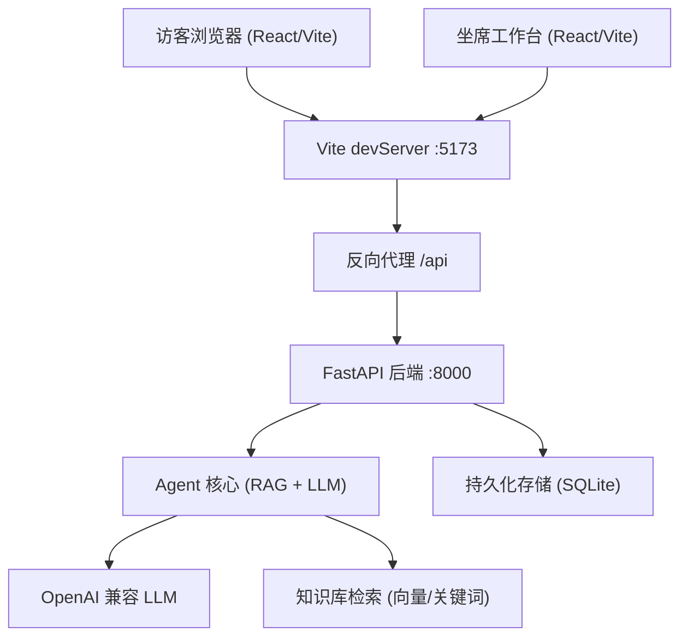

# Online CS Agent

Feature Name: online-cs-agent
Updated: 2026-09-22

## Description

基于 Web 全栈的在线客服答疑 Agent。前后端分离：React + Vite 前端，FastAPI 后端，/api 反向代理。Agent 大脑接 OpenAI 兼容 LLM，采用 RAG（知识库检索 + 上下文注入）保证回答贴合真实知识。支持会话持久化、升级人工坐席、坐席工作台。

## Architecture

### 组件与接口

- **frontend/**：Vite + React。两条路由：`/` 访客聊天页，`/operator` 坐席工作台。Vite 配置 `server.proxy` 把 `/api` 转发到 `http://localhost:8000`，并加入 `.monkeycode-ai.online` 到 `allowedHosts`。
- **backend/**：FastAPI。
  - `POST /api/sessions`：创建会话，返回 session_id
  - `POST /api/sessions/{id}/messages`：访客发消息，返回 Agent 回答（含引用、置信度、是否升级）
  - `GET /api/sessions/{id}/messages`：拉取会话消息
  - `POST /api/sessions/{id}/escalate`：访客显式转人工
  - `GET /api/operator/queues`：坐席查看待接管会话 + 待处理工单
  - `POST /api/operator/take/{session_id}`：坐席接管
  - `POST /api/operator/reply/{session_id}`：坐席回复（WebSocket 实时推送给访客）
  - `ws /ws/{session_id}`：坐席回复实时推送通道
- **agent_core/**：RAG 检索 + LLM 调用。
  - 检索：优先向量（embedding）+ 关键词混合，top-K=4；语料为 `data/kb.json`（FAQ 条目，含 id/text/answer/tags）。
  - LLM：OpenAI 兼容 chat 接口，system prompt 注入检索到的 KB 条目与最近 10 轮历史；要求模型输出 JSON（answer / citations / confidence / escalate）。
  - 置信度 < 0.6 或访客输入"转人工" → 置 escalate 标记。
- **storage/**：SQLite 持久化 `sessions` / `messages` / `tickets` 表。

## Data Models

- Session: id, visitor_id, started_at, ended_at, escalated(bool), escalate_reason, status(ongoing|pending_agent|agent_handled|closed)
- Message: id, session_id, role(visitor|agent|operator), content, refs[]（引用 KB id）, created_at
- Ticket: id, session_id, priority, status(pending|processing|resolved), assignee, created_at, resolved_at, duration_s

## Correctness Properties

- 每次 Agent 回答必须附带 citations 数组；无检索命中时 citations 为空且 escalate=true。
- LLM 输出必须是可解析 JSON；解析失败时走兜底话术并 escalate。
- 会话状态机单向：ongoing → pending_agent → agent_handled → closed。

## Error Handling

- LLM 超时/失败：返回固定兜底话术"正在为您转接人工坐席"，触发升级流程。
- 知识库为空：直接走升级流程，不编造。
- 启动时缺少 USER_LLM_API_KEY / USER_LLM_BASE_URL / USER_LLM_MODEL：启动失败并打印缺失项清单。

## Test Strategy

- 单测：agent_core 的检索排序、LLM 输出解析、置信度判定、升级触发条件。
- 集成测：创建会话 → 发消息 → 命中 KB 返回引用 → 发"转人工" → 坐席接管 → 坐席回复。
- 前端手动验证：代理 /api 是否通、加载态、空态。

## References

[^1]: 需求见同目录 requirements.md
[^2]: LLM 凭据走 USER_LLM_API_KEY / USER_LLM_BASE_URL / USER_LLM_MODEL，禁止引用平台内部密钥
